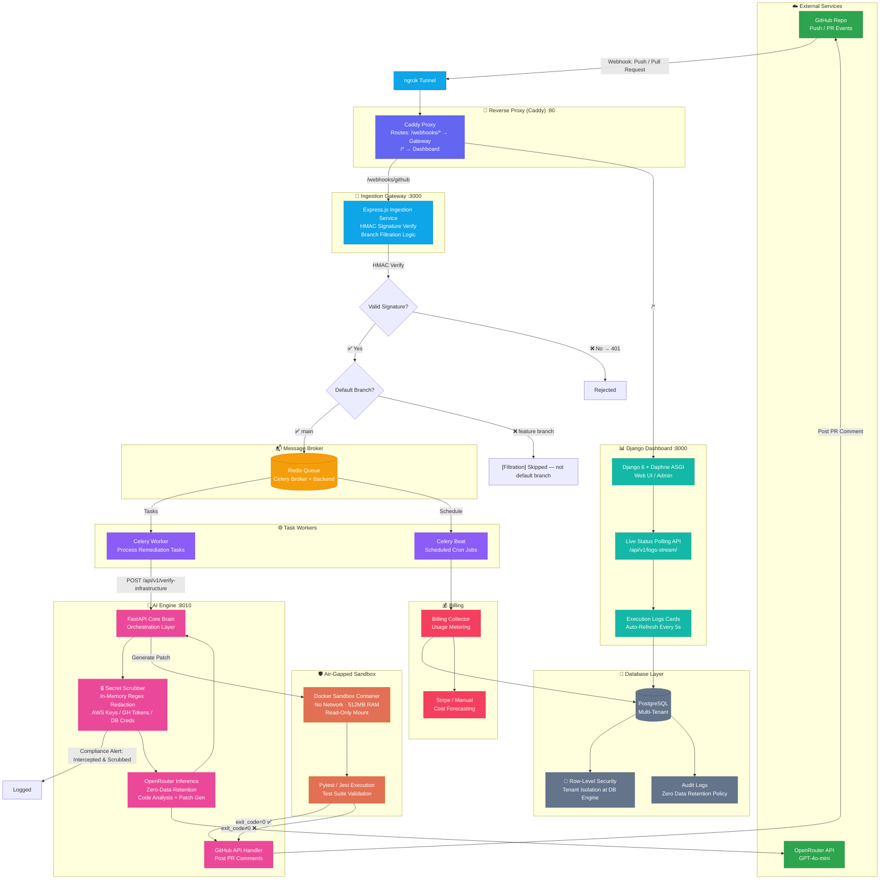

# AI DevOps Engine

[](LICENSE)
[](https://python.org)
[](https://nodejs.org)
[](https://docker.com)

An autonomous, zero-data-retention AI DevOps pipeline that ingests GitHub webhooks, constructs code patches via LLM, runs them in air-gapped Docker sandboxes (Pytest/Jest), and commits validated fixes directly to Pull Requests — all self-hosted with one `docker compose` command.

- **No SaaS fees** — you only pay the AI provider directly for tokens used
- **Zero data retention** — code scrubbed in memory, destroyed after inference
- **Air-gapped sandbox** — patches run in network-isolated, resource-throttled containers
- **Multi-tenant** — PostgreSQL Row-Level Security isolates tenants at the database engine level

---

## Quickstart (from zero to running in ~10 minutes)

### Prerequisites

- Docker & Docker Compose (v2+)
- Node.js 18+
- Python 3.11+
- [OpenRouter API key](https://openrouter.ai/keys) (free tier available)
- [ngrok](https://ngrok.com/download) (free tier — exposes local webhook to GitHub)

### 1. Clone & Configure

```bash
git clone https://github.com/your-username/ai-devops-engine.git
cd ai-devops-engine
cp .env.example .env
```

Create the `certs/` directory and place the `.pem` file there:

```bash
mkdir -p certs
# Move the downloaded .pem file into certs/
mv ~/Downloads/your-app-private-key.pem certs/github_app.pem
```

Edit `.env` with your keys:

| Variable | What to put | Required |
|----------|-------------|----------|
| `OPENROUTER_API_KEY` | Your OpenRouter API key | Yes |
| `OPENROUTER_MODEL` | Model name (e.g. `openai/gpt-4o-mini`, `openrouter/qwen/qwen-2.5-coder-32b-instruct`) | No |
| `GITHUB_APP_IDENTIFIER` | GitHub App ID number (from app settings page) | Yes |
| `GITHUB_WEBHOOK_SECRET` | Webhook secret you set in GitHub App settings | Yes |
| `DJANGO_SECRET_KEY` | Run `python -c "import secrets; print(secrets.token_urlsafe(50))"` | Yes |
| `FERNET_KEY` | Run `python -c "from cryptography.fernet import Fernet; print(Fernet.generate_key().decode())"` | Yes |
| `SLACK_ALERTS_WEBHOOK_URL` | Slack webhook URL for crash alerts | No |
| `SLACK_ANALYSIS_WEBHOOK_URL` | Slack webhook URL for analysis results | No |
| `PAYMENT_GATEWAY` | `stripe` or `manual` | No |
| `AUDIT_RETENTION_DAYS` | How long to keep audit logs (default: 90) | No |

> **Note:** `certs/github_app.pem` is the default path the stack expects. The `CERTS_PATH=./certs` in `.env` maps this directory into every container at `/app/certs`.

### 2. Create a GitHub App

1. Go to **GitHub Settings → Developer settings → GitHub Apps → New GitHub App**
2. Set these values:
   - **GitHub App name:** anything (e.g. `ai-devops-bot`)
   - **Homepage URL:** `http://localhost:3000`
   - **Webhook URL:** your ngrok URL from step 5
   - **Webhook secret:** a random string you choose — put this in `.env` as `GITHUB_WEBHOOK_SECRET`
   - **Repository permissions:** `Contents: Write`, `Pull requests: Read & Write`, `Checks: Write`, `Metadata: Read`
   - **Subscribe to events:** `Pull request`, `Push`
3. Click **Create GitHub App**
4. On the app page: **Generate a private key** → download the `.pem` file → save it as `certs/github_app.pem` in your project root
5. Copy the **App ID** number from the top of the page → put it in `.env` as `GITHUB_APP_IDENTIFIER`
6. **Install the app** on a repo → click **Install App** in the sidebar → select a repo

### 3. Pre-Bake Sandbox Images

```bash
docker build -t local-pytest-sandbox -f sandbox-env/Dockerfile.python sandbox-env/
docker build -t local-jest-sandbox -f sandbox-env/Dockerfile.javascript sandbox-env/
```

### 4. Launch the Stack

```bash
docker compose -f docker-compose.local.yml up --build -d
```

### 5. Expose Webhook Endpoint

```bash
ngrok http http://localhost:3000
```

Copy the `https://<your-id>.ngrok-free.app` URL. Go back to your GitHub App settings and set the **Webhook URL** to `https://<your-id>.ngrok-free.app/webhooks/github`.

### 6. Trigger a PR — Watch It Run

Open any Pull Request on the repo you installed the app on. The engine will:
1. Receive the webhook → parse the diff
2. Send changed code to OpenRouter (with `data_collection: deny`)
3. Generate a patch → mount it in an air-gapped sandbox
4. Run `pytest` or `jest` — on pass, post the fix as a PR comment for review
5. Log the result in the Django dashboard at `http://localhost:8000`

You can also test with a manual curl (requires `openssl`):

```bash
WEBHOOK_SECRET="${GITHUB_WEBHOOK_SECRET?}"

payload='{"action":"opened","pull_request":{"number":1},"repository":{"id":101,"full_name":"local-org/test-repo","clone_url":"local_vfs"},"installation":{"id":202}}'

sig=$(printf '%s' "$payload" | openssl dgst -sha256 -hmac "$WEBHOOK_SECRET" | awk '{print $NF}')

curl -X POST http://localhost:3000/webhooks/github \
  -H "Content-Type: application/json" \
  -H "x-github-event: pull_request" \
  -H "x-hub-signature-256: sha256=$sig" \
  -d "$payload"
```

### 7. (Optional) Use the CLI

```bash
# Install (one-time)
chmod +x infra/patch-bot.sh
alias patch-bot=./infra/patch-bot.sh

# Fix a file
patch-bot my_app/main.py "pagination breaks when page number exceeds total pages"
```

---

## Architecture



### Services

| Service | Technology | Role |
|---------|-----------|------|
| `ingestion-service` | Node.js + Express | GitHub webhook receiver, path filtering, task queuing |
| `core-brain` | FastAPI + Celery | AI orchestration, secret scrubbing, Docker sandbox control |
| `django-dashboard` | Django 6 + Daphne ASGI | Web UI, audit logs, multi-tenant admin, billing |
| `sandbox-env` | Docker (air-gapped) | Pre-baked Pytest/Jest images, no network, 512MB RAM cap |
| `billing-collector` | Python | Cost forecasting, usage metering, AWS/GCP poll |
| `redis-broker` | Redis 7 | Celery message queue + result backend |

---

## Security

| Layer | Mechanism |
|-------|-----------|
| Code storage | **Zero persistence** — PostgreSQL stores only operational metadata, never source code |
| LLM privacy | **`data_collection: deny`** on every OpenRouter request — legally blocks training on your code |
| Secret scrubbing | **In-memory regex** — AWS keys, GH tokens, DB credentials masked before transit |
| Patch execution | **Air-gapped Docker** — no network access, 512MB RAM / 2 CPU hard limit, no host FS mount |
| Tenant isolation | **PostgreSQL RLS** — database-enforced row separation, bypasses Django `.filter()` |
| Container leaks | **Background cron** — auto-prunes orphaned sandbox containers on execution freeze |
