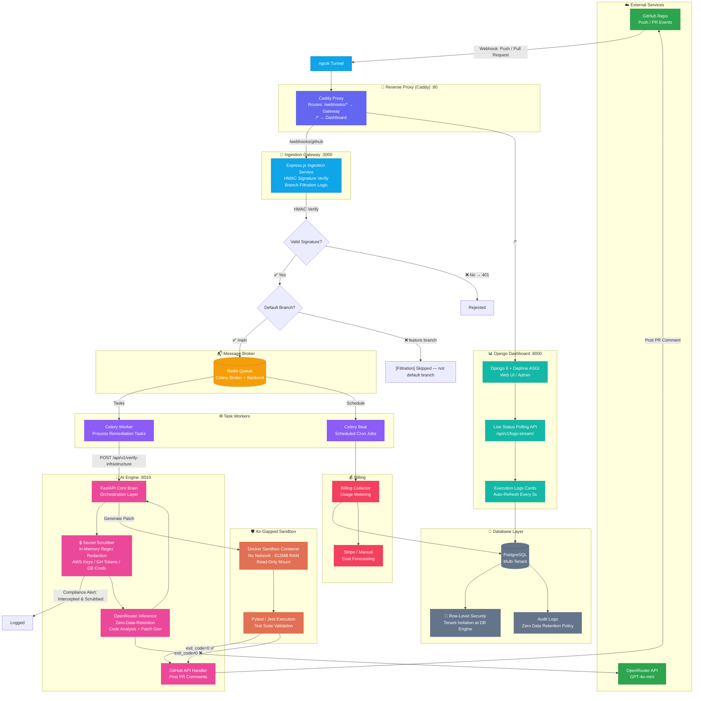

# AI DevOps Engine

[](LICENSE)
[](https://python.org)
[](https://nodejs.org)
[](https://docker.com)

An autonomous, zero-data-retention AI DevOps pipeline that ingests GitHub webhooks, constructs code patches via LLM, runs them in air-gapped Docker sandboxes (Pytest/Jest), and posts validated fixes as PR comments for your review — all self-hosted with one `docker compose` command.

- **No SaaS fees** — you only pay the AI provider directly for tokens used
- **Zero data retention** — code scrubbed in memory, destroyed after inference
- **Air-gapped sandbox** — patches run in network-isolated, resource-throttled containers
- **Multi-tenant** — PostgreSQL Row-Level Security isolates tenants at the database engine level

---

## Quickstart (from zero to running in ~2 minutes)

### Prerequisites

- Docker & Docker Compose (v2+)
- Python 3.11+, Node.js 18+
- [OpenRouter API key](https://openrouter.ai/keys) — free tier works
- [ngrok](https://ngrok.com/download) — free tier, exposes your local webhook to GitHub

---

### Fast Path (3 commands)

**macOS / Linux:**
```bash
# 1. Auto-generate secrets, prompt for your OpenRouter key
make setup

# 2. Pre-bake sandbox images (one-time)
make sandbox

# 3. Launch the full stack
make up
```

**Windows (PowerShell):**
```powershell
# 1. Auto-generate secrets, prompt for your OpenRouter key
.\setup.ps1 setup

# 2. Pre-bake sandbox images (one-time)
.\setup.ps1 sandbox

# 3. Launch the full stack
.\setup.ps1 up
```

**Dashboard:** http://localhost:8000  ·  **Gateway:** http://localhost:3000

Then expose your webhook and open a PR:

```bash
# 4. Expose via ngrok (separate terminal)
ngrok http http://localhost:3000

# 5. Open any PR on your repo — the engine handles the rest
```

---

### Detailed Setup (for first-time configuration)

#### 1. Configure Environment

`make setup` copies `.env.example → .env`, generates secure random values for `DJANGO_SECRET_KEY` and `FERNET_KEY`, then prompts for your OpenRouter key. After that, set two more values manually:

| Variable | What to put | Required |
|----------|-------------|----------|
| `GITHUB_APP_IDENTIFIER` | GitHub App ID number | Yes |
| `GITHUB_WEBHOOK_SECRET` | Webhook secret you set in GitHub App settings | Yes |

Place the GitHub App `.pem` file at `certs/github_app.pem`.

#### 2. Create a GitHub App

1. **GitHub Settings → Developer settings → GitHub Apps → New GitHub App**
2. Settings:
   - **GitHub App name:** `ai-devops-bot`
   - **Homepage URL:** `http://localhost:3000`
   - **Webhook URL:** `https://<your-ngrok-id>.ngrok-free.app/webhooks/github`
   - **Webhook secret:** pick a random string → set as `GITHUB_WEBHOOK_SECRET` in `.env`
   - **Permissions:** `Contents: Write`, `Pull requests: Read & Write`, `Checks: Write`, `Metadata: Read`
   - **Events:** `Pull request`, `Push`
3. **Generate a private key** → save as `certs/github_app.pem`
4. Copy the **App ID** → set as `GITHUB_APP_IDENTIFIER` in `.env`
5. **Install the app** on a repo

#### 3. Pre-Bake & Launch

```bash
make sandbox   # build local-pytest-sandbox + local-jest-sandbox images
make up        # docker compose up -d
```

#### 4. Test with a Curl

```bash
make demo
```

Or manually:

```bash
WEBHOOK_SECRET="${GITHUB_WEBHOOK_SECRET?}"
payload='{"action":"opened","pull_request":{"number":1},"repository":{"id":101,"full_name":"local-org/test-repo","clone_url":"local_vfs"},"installation":{"id":202}}'
sig=$(printf '%s' "$payload" | openssl dgst -sha256 -hmac "$WEBHOOK_SECRET" | awk '{print $NF}')
curl -X POST http://localhost:3000/webhooks/github \
  -H "Content-Type: application/json" \
  -H "x-github-event: pull_request" \
  -H "x-hub-signature-256: sha256=$sig" \
  -d "$payload"
```

### How It Works

When a PR is opened on your repo:
1. GitHub sends a webhook → gateway verifies HMAC signature
2. Gateway filters to default branch → enqueues task in Redis
3. Celery worker picks up → AI engine scrubs secrets → calls OpenRouter
4. Generated patch runs in air-gapped Docker sandbox (Pytest/Jest)
5. On test pass: bot posts the fix as a PR comment for your review
6. Dashboard logs every step at http://localhost:8000

### Optional CLI

```bash
chmod +x infra/patch-bot.sh
alias patch-bot=./infra/patch-bot.sh
patch-bot my_app/main.py "pagination breaks when page number exceeds total pages"
```

---

## Architecture



### Services

| Service | Technology | Role |
|---------|-----------|------|
| `ingestion-service` | Node.js + Express | GitHub webhook receiver, path filtering, task queuing |
| `core-brain` | FastAPI + Celery | AI orchestration, secret scrubbing, Docker sandbox control |
| `django-dashboard` | Django 6 + Daphne ASGI | Web UI, audit logs, multi-tenant admin, billing |
| `sandbox-env` | Docker (air-gapped) | Pre-baked Pytest/Jest images, no network, 512MB RAM cap |
| `billing-collector` | Python | Cost forecasting, usage metering, AWS/GCP poll |
| `redis-broker` | Redis 7 | Celery message queue + result backend |

---

## Security

| Layer | Mechanism |
|-------|-----------|
| Code storage | **Zero persistence** — PostgreSQL stores only operational metadata, never source code |
| LLM privacy | **`data_collection: deny`** on every OpenRouter request — legally blocks training on your code |
| Secret scrubbing | **In-memory regex** — AWS keys, GH tokens, DB credentials masked before transit |
| Patch execution | **Air-gapped Docker** — no network access, 512MB RAM / 2 CPU hard limit, no host FS mount |
| Tenant isolation | **PostgreSQL RLS** — database-enforced row separation, bypasses Django `.filter()` |
| Container leaks | **Background cron** — auto-prunes orphaned sandbox containers on execution freeze |
